# LibreVigilant — User Guide

LibreVigilant is a self-hosted web application for tracking your organisation's compliance against
[CIS Controls v8.1.2](https://www.cisecurity.org/controls/v8). It covers all 153 safeguards across
18 controls, supports multiple projects and team members, and maintains a living risk register that
you update across successive assessment cycles.

**Typical workflow:** deploy → create users → create a project → run an initial assessment →
import gaps to the risk register → compare follow-on assessments → close resolved risks.

---

## Contents

1. [Deployment](#1-deployment)
2. [First Run](#2-first-run)
3. [Creating a Project and Adding Members](#3-creating-a-project-and-adding-members)
4. [Running an Assessment](#4-running-an-assessment)
5. [Risk Register](#5-risk-register)
6. [Comparing Assessments](#6-comparing-assessments)
7. [Follow-on Assessments](#7-follow-on-assessments)

---

## 1. Deployment

**Docker is the recommended way to run LibreVigilant** (Option B) — it bundles a production
WSGI server and keeps the host clean. Option A (running Python directly) is documented for
servers or laptops where Docker isn't available or wanted.

### Option A — Running directly with Python

Requirements: Python 3.10+.

We recommend using a virtual environment to isolate dependencies:

```bash
python3 -m venv venv && source venv/bin/activate
```

```bash
git clone https://github.com/your-org/librevigilant.git
cd librevigilant
pip install -r requirements.txt
SECRET_KEY=your-secret-here python3 app.py
```

The app starts on port 5000. SQLite database (`librevig.db`) and the `uploads/` folder are created
automatically on first run. Set `SECRET_KEY` to a long random string — without it, sessions are
invalidated every time the process restarts.

This is fine for trying the app out or a home lab. The above runs Flask's built-in development
server in the foreground (`Ctrl+C` to stop) — it is single-threaded and not hardened for
team-facing or networked use. For anything beyond a quick trial, use the production setup below.

> **Windows:** Gunicorn does not run on Windows. Use Docker, Podman, or WSL instead — see
> Option B.

#### Running in production: Gunicorn

Run the app behind Gunicorn instead of the dev server:

```bash
SECRET_KEY=your-secret-here gunicorn --preload -w 2 -b 0.0.0.0:5000 app:app
```

This still runs in the foreground. For a real deployment you want it running in the background,
restarting automatically on crash or reboot, and easy to start/stop — use systemd for that.

#### Running in production: systemd service

Create `/etc/systemd/system/librevigilant.service` (adjust `User`, `WorkingDirectory`, and the
venv path to match your install):

```ini
[Unit]
Description=LibreVigilant
After=network.target

[Service]
User=librevigilant
WorkingDirectory=/opt/librevigilant
Environment=SECRET_KEY=your-secret-here
ExecStart=/opt/librevigilant/venv/bin/gunicorn --preload -w 2 -b 0.0.0.0:5000 app:app
Restart=on-failure

[Install]
WantedBy=multi-user.target
```

Then:

```bash
sudo systemctl daemon-reload
sudo systemctl enable --now librevigilant   # start now, and on every boot
```

Common commands:

```bash
sudo systemctl stop librevigilant
sudo systemctl restart librevigilant
sudo systemctl status librevigilant
journalctl -u librevigilant -f              # follow logs
```

### Option B — Docker (recommended)

Requirements: Docker with the Compose plugin.

```bash
git clone https://github.com/your-org/librevigilant.git
cd librevigilant
echo "SECRET_KEY=$(openssl rand -hex 32)" > .env
mkdir -p data && sudo chown 1000:1000 data
docker compose up -d
```

The container runs as a non-root user (uid 1000), so the host `./data` directory must be
writable by that uid — the `chown` step above takes care of that. If you skip it, Compose will
create `./data` as `root:root` and the app will fail to create `librevig.db` inside it.

The app is available at `http://localhost:5000`. `librevig.db` and the `uploads/` folder are
persisted on the host under `./data/`, so they survive container rebuilds and `docker compose
down`. The container runs the app via Gunicorn, not the Flask dev server.

Common commands:

```bash
docker compose logs -f      # follow logs
docker compose restart      # restart the app
docker compose down         # stop and remove the container (data in ./data/ is kept)
```

### Option C — Docker Compose with a reverse proxy

> Examples using Traefik or Caddy for automatic TLS in front of the Option B Compose setup are
> planned as a follow-up. Until then, put your own reverse proxy (Traefik, Caddy, nginx) in front
> of the container from Option B, forwarding to port 5000.

---

## 2. First Run

On the very first visit, the app redirects you to `/setup`. Fill in a display name, email address,
and password — this creates the **instance admin** account. The setup page is only accessible while
no users exist; it locks itself permanently once the first account is created. After setup you are
logged in automatically and land on the home page.

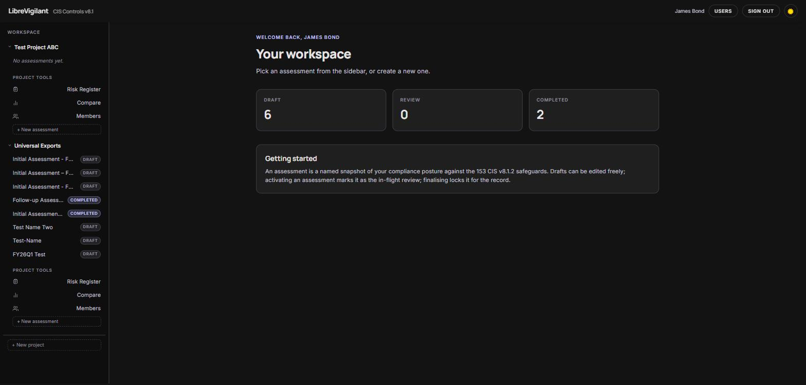

From here, create your first project or add further user accounts (via the **Users** page in the
top navbar, visible to instance admins only).

**Adding users:** LibreVigilant has no self-registration and requires no email server. Instance
admins create accounts directly on the Users page: provide a display name, email, and temporary
password, then share those credentials with the person.

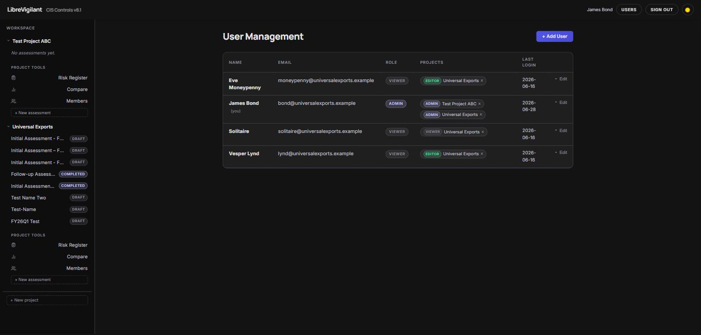

**Changing your password:** Once logged in, click your display name in the top navbar to open the
**Change password** dialog. Enter your current password and a new one (minimum 12 characters) to
update it immediately — no admin involvement needed. Instance admins can still force-reset any
user's password from the Users page if someone is locked out.

The sign-in page is shown on any unauthenticated visit:

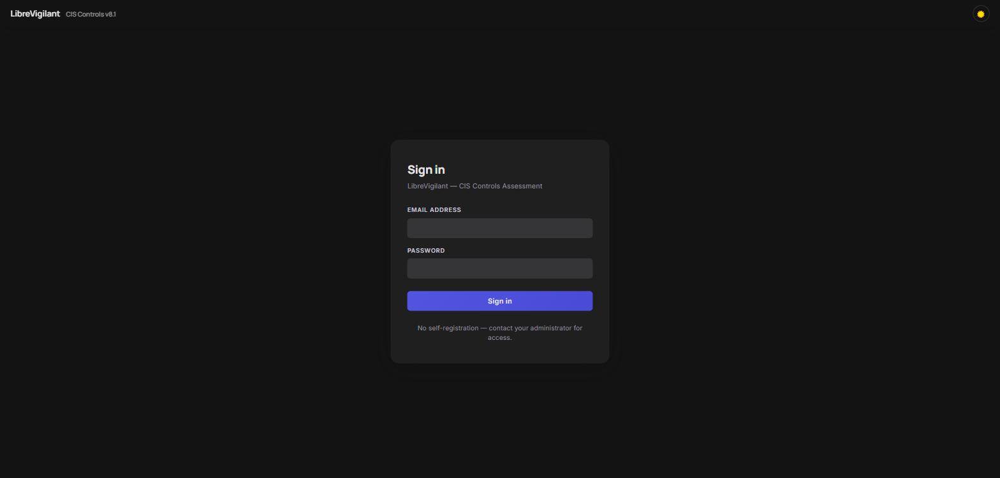

---

## 3. Creating a Project and Adding Members

A **Project** is the top-level container for all your compliance work. Each project holds its own
assessments, risk register, and audit history. You can run multiple projects in parallel — for
example, one per business unit or client engagement.

**Create a project:** Click **+ New project** at the bottom of the left sidebar. Give it a name;
LibreVigilant generates a URL slug automatically. The project appears in the sidebar immediately.

**Add members:** Open the project in the sidebar and click **Members** under Project tools. Use
the dropdown to select an existing user and assign them a role:

| Role | What they can do |
|---|---|
| **Admin** | Full control — create and delete assessments, manage members, import to risk register |
| **Editor** | Assess safeguards, add notes and evidence, edit risk items |
| **Viewer** | Read-only access to all project data, can export CSV |

A user can hold different roles across different projects. The instance admin role (set on the
Users page) only grants access to the Users page — project roles govern everything within a project.

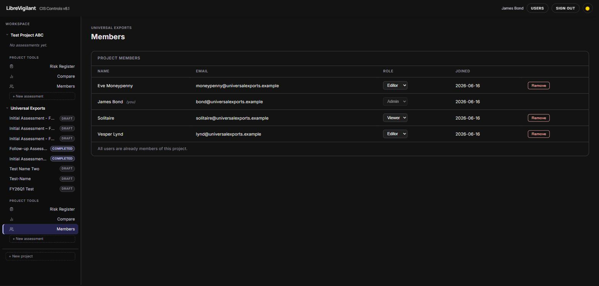

---

## 4. Running an Assessment

An assessment is a point-in-time snapshot of your compliance posture against all 153 CIS safeguards.

**Create:** From the sidebar, click **+ New assessment** under the project name. A modal appears
asking for a name and a starting point — either blank or copied from a previous assessment in the
same project. Copying pre-populates all safeguard statuses and notes, so you only need to record
what changed. Only project admins can create assessments.

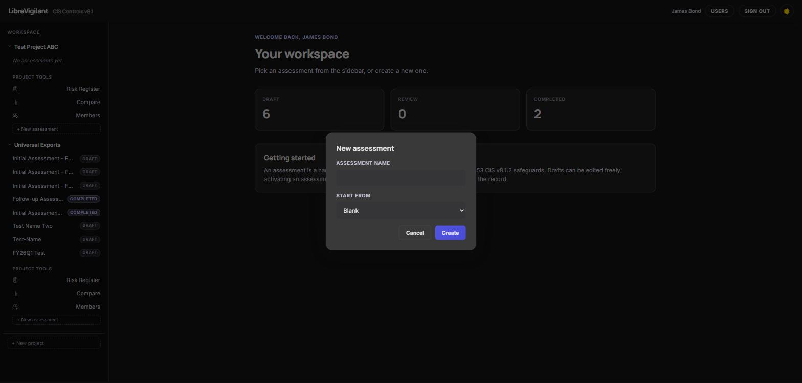

**Assess safeguards:** Open the assessment to see the full accordion view, grouped by CIS control.
Score cards and a radar chart at the top update live as you work.

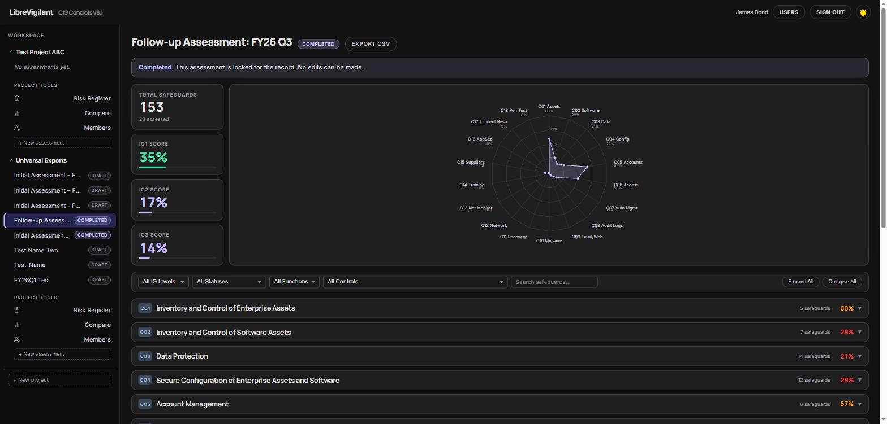

Expand any control to see its safeguards. Set a status on each:

| Status | Meaning |
|---|---|
| Not assessed | Default — not yet reviewed |
| Not implemented | The control is absent |
| Partial | Some elements in place but not complete |
| Implemented | Fully in place |
| Not applicable | Excluded from scope with justification |

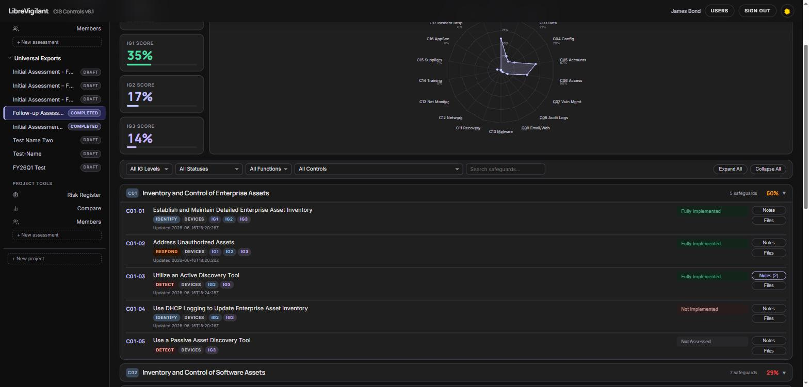

Editors and admins can set statuses, add notes (threaded comments per safeguard), and attach
evidence files. Click the **Notes** button on any safeguard row to open the notes panel inline.

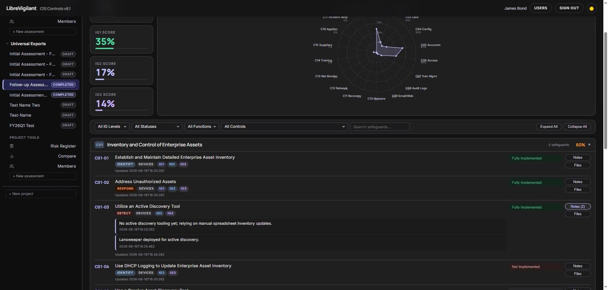

Viewers can read everything and export to CSV.

**Filtering:** Use the filter bar above the accordion to narrow by IG level, CIS function, control,
or status. Filtering is instant and client-side — no page reload.

**Lifecycle:**

1. **Draft** — editable by all editors and admins.
2. **In Review** — an admin clicks *Start review* to signal the assessment is under final
   scrutiny. Still editable.
3. **Completed** — an admin clicks *Complete*. The assessment becomes permanently read-only and
   its results are preserved for comparison and risk register import.

An assessment must reach Completed before it can be imported to the risk register or used in
a comparison.

---

## 5. Risk Register

The risk register is project-scoped — it persists across assessments and accumulates your
remediation plan over time. All open gaps (non-implemented safeguards) from any completed
assessment can be imported into it.

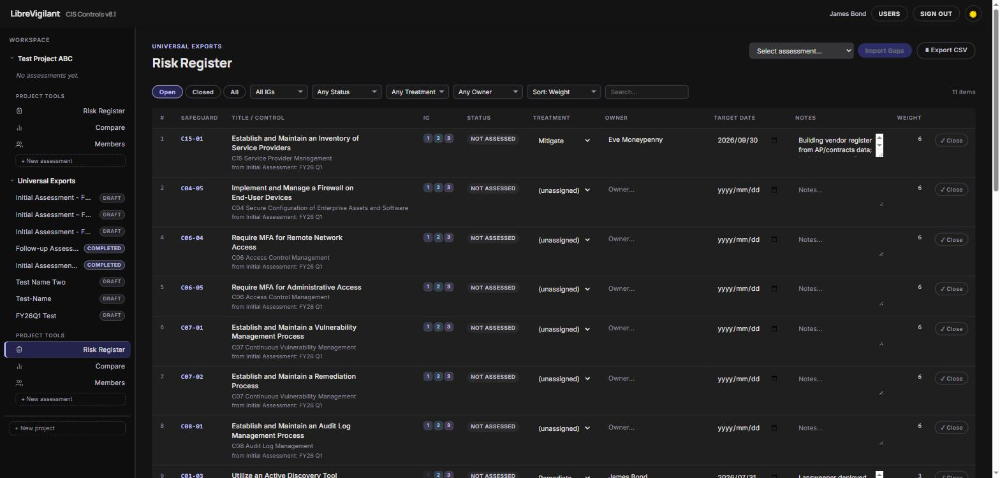

**Import:** On the Risk Register page, select a completed assessment and click **Import gaps**.
LibreVigilant adds any safeguards with a status of *Not implemented* or *Partial* that aren't
already in the register. Existing items are never overwritten — your treatment notes, owners, and
target dates are safe.

Each imported item is assigned a **risk weight** (`IG1 × 3 + IG2 × 2 + IG3 × 1`, halved for
Partial status). Items are listed highest-weight first by default.

**Triage each item** by clicking its row to expand the inline editor:

- **Treatment** — Accept, Mitigate, Transfer, Avoid, or Remediate
- **Owner** — free text; name or team responsible
- **Target date** — ISO date for planned completion
- **Notes** — context, decisions, links to tickets

**Close an item** once the safeguard is implemented. The Current Status column (pulled from the
most recent assessment) shows whether a safeguard has improved since the item was opened — an
amber *Resolved in latest* badge appears when it has. Items can be reopened if circumstances change.

**Export:** Download the full register as CSV for use in spreadsheets or reports.

---

## 6. Comparing Assessments

The Compare view lets you place two completed assessments side by side. Select them from the
dropdowns and click **Compare**. You get:

- **Dual-polygon radar chart** — one polygon per assessment, overlaid on the same 18-control axes.
  Score per control runs 0–100% based on implemented and partial safeguards (not-applicable
  safeguards are excluded from the denominator).
- **Delta table** — every control listed with its score in each assessment and the percentage-point
  change. Controls that improved are highlighted; the net change and counts of improved, declined,
  and unchanged controls are summarised in the legend panel.

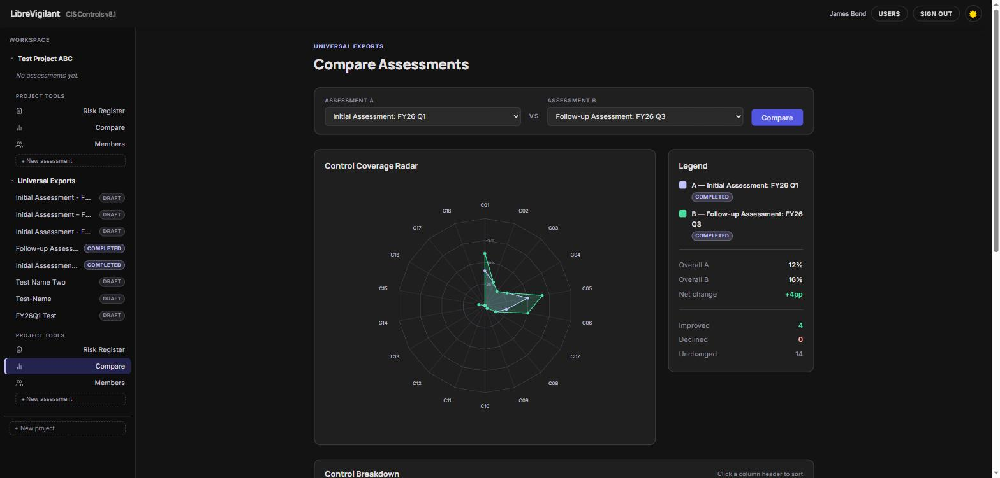

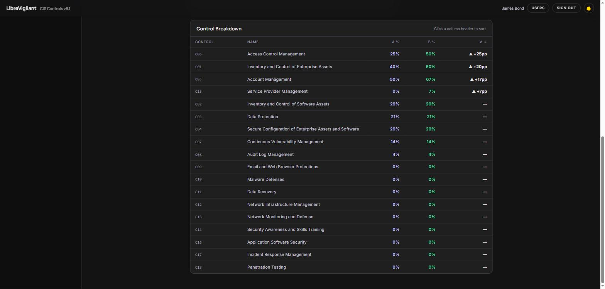

This view is most useful for comparing a baseline against a follow-on assessment to demonstrate
progress, or for comparing two projects against a shared benchmark.

---

## 7. Follow-on Assessments

CIS compliance is not a one-time exercise. Create a new assessment at each review cycle (quarterly,
annually, or after significant infrastructure change) and repeat the workflow from section 4.

When creating a new assessment, the **Start from** dropdown lets you copy an existing assessment
as a template. This pre-populates all safeguard statuses and notes so you only need to record
what changed since the previous cycle — a significant time saving on large assessments.

Once the new assessment is completed:

1. **Re-import to the risk register.** Import from the new assessment. Items already in the
   register are skipped; new gaps are added.
2. **Review reconciliation suggestions.** After import, LibreVigilant checks whether any open risk
   items are now showing *Implemented* in the new assessment. If any are found, a modal lists them
   and lets you close them in bulk — your treatment notes are preserved.
3. **Update the register.** Work through any new items, update owners and target dates, and close
   anything else that has been remediated.
4. **Compare.** Use the Compare view to show progress between the previous and new assessment.

Over time, the risk register becomes a living remediation roadmap that carries your decisions and
history forward, regardless of how many assessment cycles have passed.
